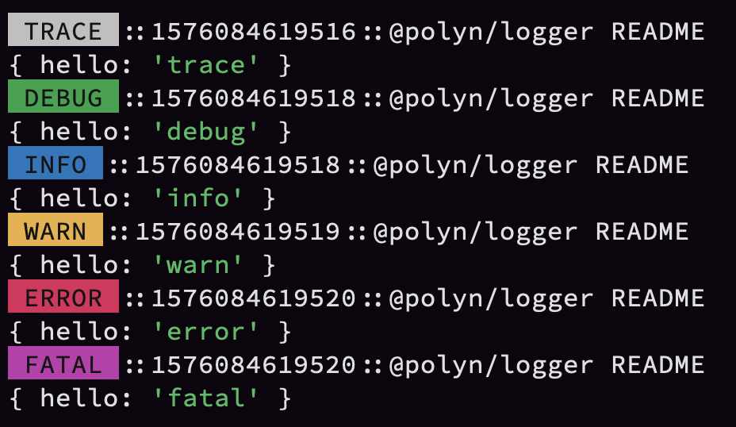
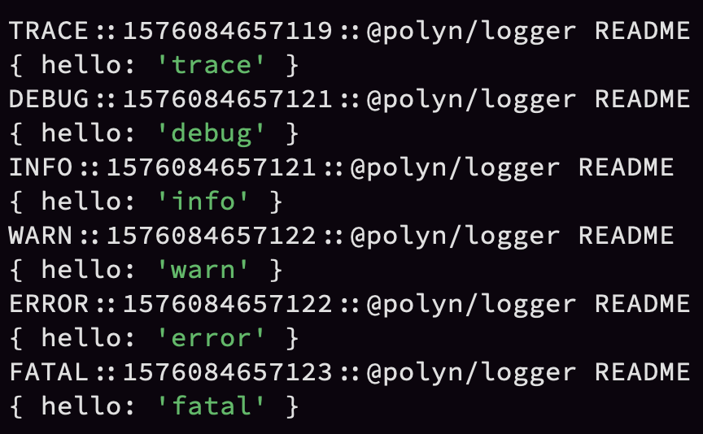
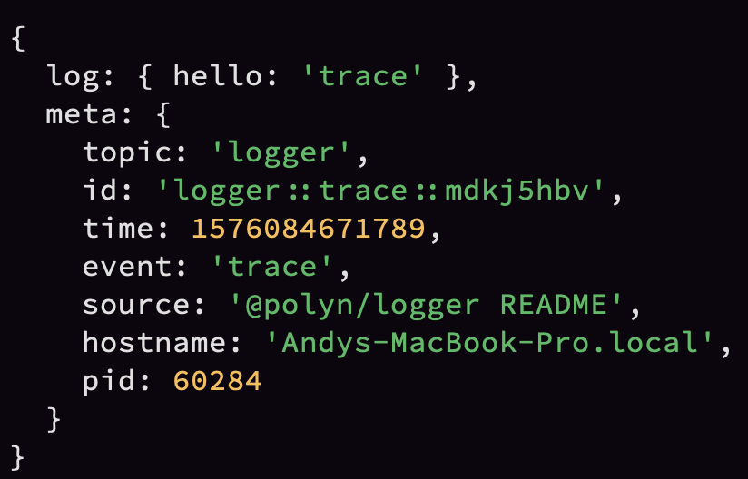
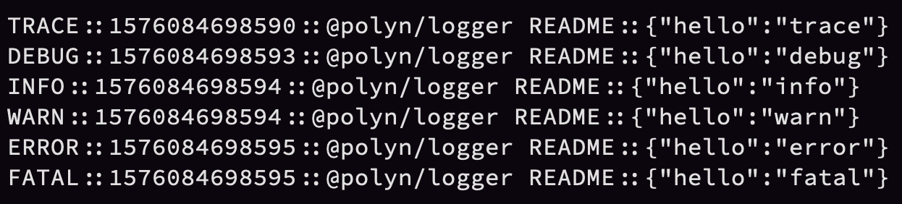
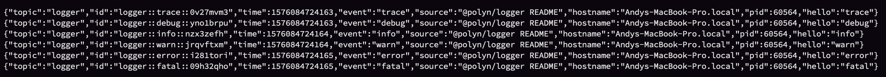
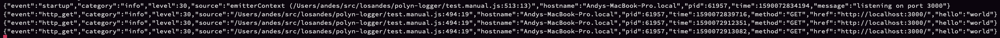
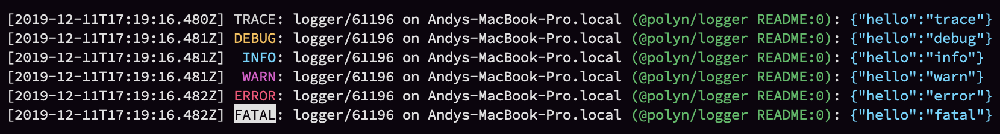

# @polyn/logger

@polyn/logger is an event based logger for NodeJS.



## Getting Started

```Shell
> npm install --save @polyn/logger
```

### Creating a LogEmitter

All logs are written to a log emitter, which is an extension of [NodeJS' events API](https://nodejs.org/api/events.html). It overrides the default `emit` with an opinion about what the second argument should be:

```TypeScript
/**
 * Emits an event, with a verbosity level
 * @param {string | symbol} event - a unique name for the event being emitted
 * @param {string} category - a verbosity / level / topic for the event
 *    (i.e. debug, info, error, audit_info, audit_warn, count, gauge, etc.)
 * @param {any[]} ...args - the value(s) you wish to log
 */
emit(event: string | symbol, category: string, ...args: any[]): boolean;
```

```JavaScript
const { LogEmitter, writers, formatters } = require('@polyn/logger')
const log = new LogEmitter()
const logWriter = new writers.DevConsoleWriter({
  formatter: new formatters.BlockFormatter()
})

// subscribe to a category
log.on('info', logWriter.listen)

// subscribe to multiple categories
;['trace', 'debug', 'info', 'warn', 'error', 'fatal'].forEach(
  (category) => log.on(category, logWriter.listen)
)

// subscribe to an event
log.on('app_startup', logWriter.listen)

// subscribe to all events
log.on('*', logWriter.listen)

// subscribe to events that have no subscriptions
log.on('no_listeners', logWriter.listen)

log.emit('app_startup', 'info', { hello: 'world' })
```

## What does "event based" mean in the context of logging?

In my career, most of the logging libraries that I've used either had a static set of verbosities, or were level based (10 is trace, 20 is debug, etc.). Often, they weren't extensible in the way that I needed them to be, so in order to meet product, and project needs, I've consistently done unnaturally complex things to... log information.

_So is this logger complex then?_

No. It's dead simple. It just follows a flexible event structure, instead of a fixed one. It treats disparate logging needs as a compositional problem.

For instance, we typically need to log/track many domains of information: debugging, event (info, errors), audit (PII), performance (latency), metrics (counts, and gauges), and so on. We often use a combination of technologies to deal with these domains, and it's easy for code to get overwhelmed with calls to different tracking libraries.

With @polyn/logger, all of these types of information can be written to the same logging instance, using the same patterns, and we deal with the unique aspects of each domain by subscribing to the events with purposeful log writers.

As well, code in libraries can write to this logger, and export the logger instance so code that consumes those libraries can choose whether or not to subscribe to the logs, metrics, etc.

Assuming we inject the loggers into our code (deterministic), rather than instantiating them in our code (non-deterministic), **logs become an asset that can be evaluated in our tests, and can even be used to observe code that is not exported (private)** (i.e. `log('test', { something: 'private or encapsulated' })`).

_Why not use Bunyan, or Pino_

Bunyan and Pino are awesome. This library is both inspired by them, and can be used with them (i.e. bunyan CLI). Bunyan, and Pino work very well if you need a wide variety of destination support, and/or need just the basic trace|debug|info|warn|error|fatal. The latter is rarely true for me anymore. If that's all you need, there is a larger community built around those libraries, and you should also consider using one of them.

#### LogEmitter Options

You can override the following options when creating a `LogEmitter`

* **hostname** {string?}: The machine name (default is `os.hostname()` in NodeJS)
* **pid** {number?}: The process id (default is `process.pid()` in NodeJS)
* **wildcard** {string?}: The event name that all events are emitted to
* **noListenersEvent** {string?}: The event name that is emitted for events that have no listeners/subscribers
* **source** {string?}: The source of a given log (default is the stack line where the event was emitted)

```JavaScript
const log = new LogEmitter({
  hostname: 'my-machine',
  pid: 0,
  wildcard: '%',
  noListenersEvent: 'nada',
  source: __filename,
})
```

## Child Loggers and Piping

`LogEmitters` can spawn children, or be piped to one another, so you can create multiple loggers as needed, and either push them out (children), or pull them together (piping).

### Child Loggers

When you have control over the creation of all loggers, creating children is the simplest way to create short-lifetime loggers. This is particularly useful for adding loggers through middleware in apps that use frameworks like koa, or express.

```JavaScript
const { LogEmitter, writers, formatters } = require('@polyn/logger')
const log1 = new LogEmitter()
const log2 = log1.child()
const log3 = log2.child()
const logWriter = new writers.DevConsoleWriter({
  formatter: new formatters.BlockFormatter()
})

log1.on('info', logWriter.listen)
log2.emit('log2', 'info', { hello: 'world' })
log3.emit('log3', 'info', { hello: 'world' })
```

### Piping Loggers

When you are consuming `LogEmitters` that were created in other sources, you can pipe their events into a central `LogEmitter`, so you can listen once, instead of many times.

```JavaScript
const { LogEmitter, writers, formatters } = require('@polyn/logger')
const log1 = new LogEmitter()
const log2 = new LogEmitter()
const log3 = new LogEmitter()
const logWriter = new writers.DevConsoleWriter({
  formatter: new formatters.BlockFormatter()
})

log2.on('*', log1.pipe())
log3.on('*', log1.pipe())
log1.on('info', logWriter.listen)

log2.emit('log2', 'info', { hello: 'world' })
log3.emit('log3', 'info', { hello: 'world' })
```

## Log Context

You can add context when creating a `LogEmitter`, and this context is emitted as part of the meta for all events. This is particularly useful when adding loggers through middleware in apps that use frameworks like koa, or express.

The following example creates a `LogEmitter` per-request in a koa app using `LogEmitter.child` so we can subscribe once, instead of per-request.

```JavaScript
const { LogEmitter, writers, formatters } = require('@polyn/logger')
const Koa = require('koa')
const Router = require('koa-router')

const appLogger = new LogEmitter()
const logWriter = new writers.StdoutWriter({
  formatter: new formatters.SquashFormatter(),
})
appLogger.on('*', logWriter.listen)

const app = new Koa()
const router = new Router()

router.get('/', async (ctx) => {
  ctx.state.log.emit('http_get', 'info', { hello: 'world' })
  ctx.status = 200
  ctx.body = { hello: 'world' }
})

app.use(async (ctx, next) => {
  ctx.state = ctx.state || {}
  ctx.state.log = appLogger.child({
    context: {
      method: ctx.request.method,
      href: ctx.request.href,
    },
  })

  await next()
})

app.use(router.routes())
app.listen(3000)
appLogger.emit('startup', 'info', 'listening on port 3000')
// to see the output: curl http://localhost:3000
```

## Tracking performance and metrics

We often need to track the performance (latency) of I/O bound features (i.e. HTTP requests, database requests, API response times), as well as compute bound features (i.e. algorithms). Knowing the number of times a feature is used (counts), as well as the volume it receives (gauges) can help us understand which features are most important to our users, or if a feature is actively being used, right now.

`LogEmitter` has:

```TypeScript
tryWithMetrics(options: ITryWithMetricsOptions):
  (action: Promise<any>) => Promise<any>;
```

 This can be used to reduce the amount of effort required to gather these kinds of metrics.

```JavaScript
const { LogEmitter, writers, formatters } = require('@polyn/logger')
const log = new LogEmitter({
  // default timeout for latency measurement is 30 seconds
  latencyTimeoutMs: 30000,
  METRICS_CATEGORIES: {
    WARN: {
      CATEGORY: 'metrics_warn', // default is 'warn'
      HELP: 'my override'
    },
    // COUNT: // same schema as WARN example
    // COUNT_ERRORS: // same schema as WARN example
    // GAUGE: // same schema as WARN example
    // GAUGE_INCREASE: // same schema as WARN example
    // GAUGE_DECREASE: // same schema as WARN example
    // LATENCY_START: // same schema as WARN example
    // LATENCY_END: // same schema as WARN example
    // LATENCY: // same schema as WARN example
  },
})
const logWriter = new writers.DevConsoleWriter({
  formatter: new formatters.BlockFormatter(),
})
const sleep = (ms) => new Promise((resolve) => setTimeout(resolve, ms))

// counts the number of occurences of a given action
log.on('count', logWriter.listen)

// counts the number of errors that occur when executing a given action
log.on('count_errors', logWriter.listen)

// tracks the number of a given action currently being executed
log.on('gauge', logWriter.listen)

// OR you can subscribe to gauge increase, and decrease separately
// tracks an increase in the number of a given action currently beint executed
log.on('gauge_increase', logWriter.listen)

// tracks an decrease in the number of a given action currently beint executed
log.on('gauge_decrease', logWriter.listen)

// tracks the beginning time of a given action
log.on('latency_start', logWriter.listen)

// tracks the end time of a given action, and emits the latency event
log.on('latency_end', logWriter.listen)

// measures the length of time it takes to complete a given action
// you can just subscribe to this, if you want the duration, and
// don't need to set a timer yourself
log.on('latency', logWriter.listen)

// for events where this module encounters unexpected behavior
// i.e. latency timeouts
log.on('metrics_warn' /* 'warn' if you didn't override this */ , logWriter.listen)

await log.tryWithMetrics({
  name: 'http_request',
  labels: {
    method: 'GET',
    href: 'https://localhost:3000',
  },
})(async () => {
  // http request here
  await sleep(5)
})

// NOTE that tryWithMetrics returns curried functions so you can:
const tryHttpRequest = log.tryWithMetrics({
  name: 'http_request',
  labels: {
    method: 'GET',
    href: 'https://localhost:3000',
  },
})
await tryHttpRequest(async () => {
  // http request here
  await sleep(5)
})
```

## Available writers, and formatters

This library exports both formatters, and writers, which can be used interchangeably, or as part of your own custom writers, or formatters. That being said, each formatter this library exports is optimized for a specific writer. The examples here illustrate that coupling.

The ArrayWriter is great for testing, and log evaluation. Which formatter you use for that really depends on how you're evaluating your logs.

Formatters:

* **BlockFormatter**
* **BunyanFormatter**
* **JsonFormatter**
* **PassThroughFormatter**
* **StringFormatter**
* **SquashFormatter**

Writers:

* **ArrayWriter**
* **ConsoleWriter**
* **DevConsoleWriter**
* **StdoutWriter**

```JavaScript
new DevConsoleWriter({ formatter: new BlockFormatter() })
```


```JavaScript
new DevConsoleWriter({
  formatter: new BlockFormatter({
    useColors: false
  })
})
```



```JavaScript
new ConsoleWriter({ formatter: new PassThroughFormatter() })
```



```JavaScript
new StdoutWriter({ formatter: new StringFormatter() })
```



```JavaScript
new StdoutWriter({ formatter: new JsonFormatter() })
```



### The SquashFormatter

Some log utilities don't like OOP / nested objects. The SquashFormatter merges the log metadata with the log you write, and flattens the structure, so it exists only on one plane. It does still yield arrays, but it flattens the contents of arrays, so all values are primitives.

```JavaScript
new StdoutWriter({ formatter: new SquashFormatter() })
```



### The bunyan formatter

The bunyan formatter accepts an `events` argument which you can use to map the events you are logging to bunyan's level system.

```JavaScript
// given these events
const events = ['local', 'trace', 'debug', 'info', 'warn', 'error', 'fatal']

// configure the bunyan levels that should be associated with them
new StdoutWriter({
  formatter: new BunyanFormatter({
    local: 10
    trace: 10
    debug: 20
    info: 30
    warn: 40
    error: 50
    fatal: 60
  })
})
```

The bunyan formatter is expected to be used with bunyan CLI: `node test | npx bunyan`.



## Cookbook: Roll your own log writer

If the provided log writers don't meet your needs, it's pretty easy to roll your own. The interface is:

```TypeScript
(meta: ILogEmitterMeta, ...args: any[]): Promise<void>;
```

where `ILogEmitterMeta` is:

```TypeScript
interface ILogEmitterMeta {
  event: string;
  category: string;
  level: number;
  source: string;
  time: number;
  hostname: string;
  pid: number;
  context?: any;
}
```

* **event** {string}: The event that was emitted
* **category** {string}: The category/verbosity that was emitted
* **level** {number}: The category as it corresponds to traditional log levels (i.e. trace: 10, debug: 20, info: 30, warn: 40, error: 50, fatal: 60)
* **source** {string}: The source of the event (i.e. the stack line)
* **time** {number}: Milliseconds since epoch that this log was written
* **hostname** {string}: The machine name
* **pid** {number}: The process id
* **context** {object?}: optional context associated with the log entry

The following example demonstrates a logger that combines the meta, and arguments together into a string. It also demonstrates an approach to pruning sensitive data out of the logs.

```JavaScript
const { LogEmitter } = require('@polyn/logger')
const log = new LogEmitter({
  context: {
    a: 'property'
  }
})

log.on('*', async (meta, ...args) => {
  const parts = [
    `[${new Date(meta.time).toISOString()}]`,
    `${meta.category.toUpperCase().padStart(6)}`,
    `(${meta.event.toUpperCase()})`.padStart(12) + ':',
    `${meta.pid} on ${meta.hostname}`,
    `(${meta.source}):`,
  ]
  const body = typeof args[0] === 'string'
    ? { ...meta.context, ...{ msg: args[0] } }
    : { ...meta.context, ...args[0] }

  delete body.secret
  console.log(parts.join(' ') + JSON.stringify(body))
})

log.emit('startup', 'info', 'listening on port 3000')
log.emit('has_secret', 'debug', { hello: 'world', secret: 'shhhhh' })
```

## Cookbook: Measuring counts, or gauges with logs

```JavaScript
const { LogEmitter } = require('@polyn/logger')
const log = new LogEmitter()

function CountWriter () {
  const counts = {}

  return {
    getCount: (name) => counts[name],
    write: async (meta, ...args) => {
      const log = args[0]
      counts[meta.event] = counts[meta.event] || { name: meta.event, count: 0 }
      counts[meta.event].count += 1
    },
  }
}

function GaugeWriter () {
  const gauges = {}

  return {
    getGauge: (name) => { return gauges[name] },
    write: async (meta, ...args) => {
      const log = args[0]
      if (meta.category === 'gauge:increase') {
        gauges[meta.event] = gauges[meta.event] || { name: meta.event, gauge: 0 }
        gauges[meta.event].gauge += 1
      } else if (meta.category === 'gauge:decrease') {
        gauges[meta.event] = gauges[meta.event] || { name: meta.event, gauge: 1 }
        gauges[meta.event].gauge -= 1
      }
    },
  }
}

const counts = new CountWriter()
const gauges = new GaugeWriter()

log.on('count', counts.write)
log.on('gauge:increase', gauges.write)
log.on('gauge:decrease', gauges.write)
log.on('metrics', (meta, ...args) =>
  console.log(meta.event, args[0])
)

const testCountMetrics = (name, expected) => {
  const actual = counts.getCount(name)
  return {
    success: expected === actual.count,
    expected: expected,
    actual,
  }
}

const testGaugeMetrics = (name, expected) => {
  const actual = gauges.getGauge(name)
  return {
    success: expected === actual.gauge,
    expected: expected,
    actual,
  }
}

log.emit('foo', 'count', { labels: { a: 'label' } })
log.emit('bar', 'count', { labels: { a: 'label' } })
log.emit('foo', 'count', { labels: { a: 'label' } })

log.emit('foo', 'metrics', testCountMetrics('foo', 2))
log.emit('bar', 'metrics', testCountMetrics('bar', 1))

log.emit('bar', 'gauge:increase', { labels: { a: 'label' } })
log.emit('foo', 'gauge:increase', { labels: { a: 'label' } })

log.emit('foo', 'metrics', testGaugeMetrics('foo', 1))
log.emit('bar', 'metrics', testGaugeMetrics('bar', 1))

log.emit('foo', 'gauge:decrease', { labels: { a: 'label' } })

log.emit('foo', 'metrics', testGaugeMetrics('foo', 0))
log.emit('bar', 'metrics', testGaugeMetrics('bar', 1))
```

## Cookbook: Measuring duration / latency with logs

```JavaScript
const { LogEmitter } = require('@polyn/logger')
const log = new LogEmitter()
const { randomBytes } = require('crypto')

function LatencyWriter () {
  const latencies = {}

  return {
    write: async (meta, ...args) => {
      const log = args[0]
      if (meta.category === 'latency:start') {
        latencies[meta.event] = {
          log,
          meta,
          start: Date.now()
        }
      } else if (meta.category === 'latency:end') {
        const end = Date.now()
        const found = latencies[meta.event]
        console.log(`LATENCY  (duration: ${end - found.start})`, found.log)
        delete latencies[meta.event]
      }
    },
  }
}

const latencyWriter = new LatencyWriter()

log.on('latency:start', latencyWriter.write)
log.on('latency:end', latencyWriter.write)

const id = randomBytes(4).toString('hex')
log.emit(id, 'latency:start', { labels: { a: 'property' } })
// does not print

setTimeout(() => {
  log.emit(id, 'latency:end')
  // prints: LATENCY (duration: 30) { hello: 'latency' }
}, 30)
```

## Legacy documentation

There is also an async event emitter that has similar features, but is more opinionated: [README.0.2.2.md](./README.0.2.2.md)
